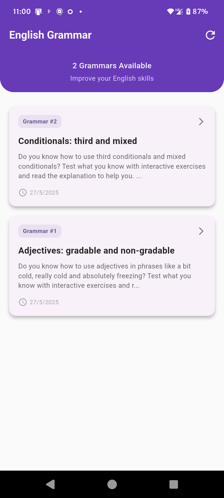
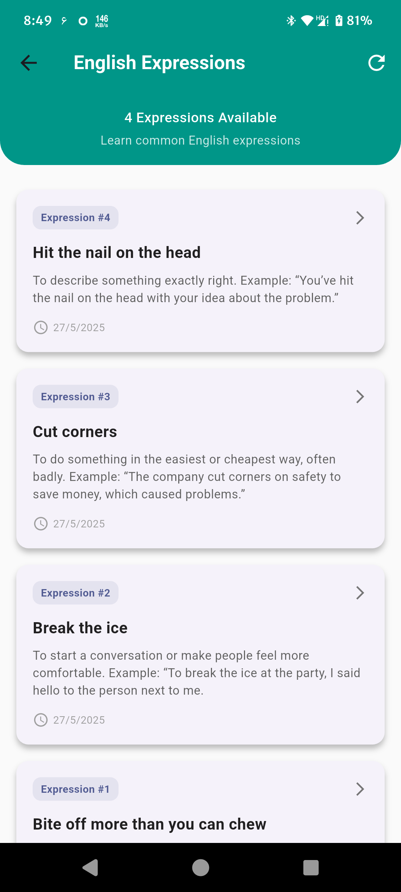
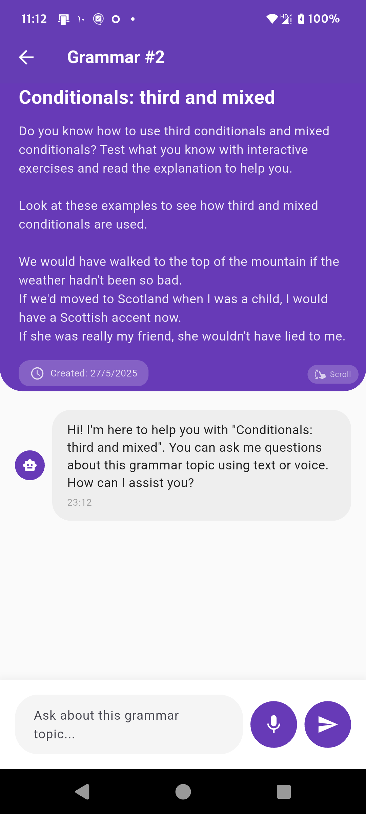

# 🎓 English AI Assistant (Voice + Text)

> **Learn English with the power of AI - Your personal English learning companion**

A beautiful and intuitive Flutter mobile application designed to help users improve their English language skills through interactive grammar lessons and common expressions. Whether you're a beginner or looking to polish your English, this AI-powered assistant makes learning engaging and effective.

## ✨ Features

### 🏠 **Home Dashboard**
- Clean and modern interface with gradient design
- Quick access to all learning modules
- Progress tracking and motivation

### 📚 **Grammar Learning**
- Interactive grammar lessons with real-world examples
- Step-by-step explanations and practice exercises

### 💬 **Common Expressions**
- Learn essential English idioms and phrases
- Real-world usage examples and context

### 🎯 **Key Benefits**
- **Interactive Learning**: Engaging exercises and explanations
- **Real-world Context**: Practical examples you can use immediately
- **Progressive Difficulty**: Start simple and advance at your pace
- **Beautiful UI**: Modern design that makes learning enjoyable
- **Offline Access**: Learn anywhere, anytime

## 🎬 Demo Video

### See the English AI Assistant in Action!

<video width="600" controls>
  <source src="https://github.com/user-attachments/assets/1033c1f0-393a-44ac-a1f4-f389c58501c6" type="video/mp4">
  Your browser does not support the video tag.
</video>

*Watch how the English AI Assistant helps you learn grammar and expressions through interactive voice and text conversations*

## 📱 Screenshots

  
### Home Screen

*Beautiful home interface with easy navigation to Grammar and Expressions modules*

### Grammar Lessons

*Comprehensive grammar lessons covering conditionals, adjectives, and more*

### English Expressions

*Learn common English idioms and expressions with practical examples*

### AI Assistant Interaction

*Interactive voice and text chat with AI assistant for personalized English learning support*

